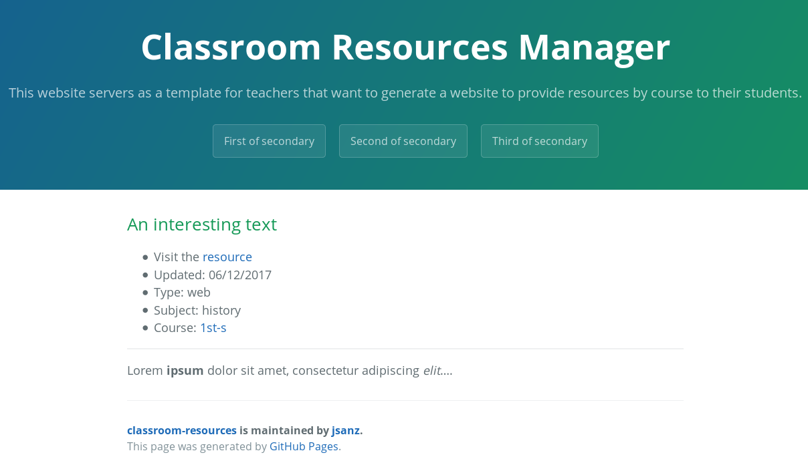
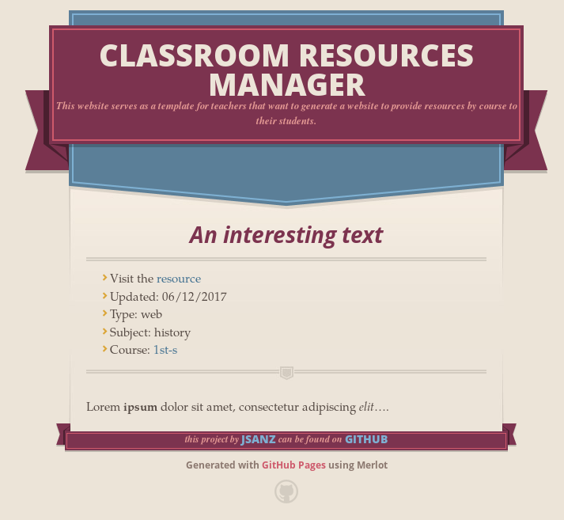

# Classroom Resources

## Why

The idea of this repository is to create a template that serves to generate websites that list resources by course and subject, so teachers can share quickly new documents, web articles and so on with their students.

I created this project to help a friend who teaches on a secondary school and needs a reliable static and easy to share website.

If you want to provide any feedback, issues or whatever just create a new [issue][6] or reach [me][7]. Of course, pull requests are always welcomed :smile:.

## Technologies

This site uses [Jekyll][1] to generate from the source code a static set of HTML and other assets to be hosted elsewhere. If you fork this repository with GitHub it's automatically published thanks to [GitHub pages][2], more details below.

## How to run in your computer

Just clone or download this repository, install [Ruby][3] and [`bundle`][4]. Then run `bundle install` on the source code folder to install all the dependencies and `bundle exec jekyll serve --incremental` to access the website from `http://localhost:3000/classroom-resources`.

## Setting it up

### Configuration

Edit the `_config.yml` to put your own title, description, your own information and remember to edit the `url` and `baseurl` to your own environment.

The website is set up in English but there are only a few places with strings you need to change to have your site in any other language, apart from the configuration described above:

* `_layout/default.html`: You may want to remove or translate the footer.
* `_includes/resource_li.html`: Adapt the `more details` text and maybe the date format (more details [here][12]).
* `_includes/resource_post.html`: Update how to present resource details

### Front page

The front page is a simple markdown file you can edit, translate, and adapt to your necessities. It's available at `_pages/frontpage.md`, feel free to keep the texts there or rearrange to your liking.

### Set up your courses and subjects

In the `_courses` folder you need to create as many text files as courses you want to present. This is an annotated course example. You can safely remove anything after the `#` character.

```md
---
title  : 'First of A level' # the name of your course
slug   : '1st-a'            # short identifier for your course (url friendly)
year   : 4                  # year for your course, for header ordering
subjects:                   # list of subjects for this course
    art:                    # identifier of your subject (case sensitive)
      title: "Art History"  # name of your subject
    history:
      title: "History"
---
```

After you have all your courses set up you can run your site and see if they are correctly shown in your front page. Then you are ready to start adding resources.

## Adding resources

The main entity is a resource. They are stored in the `_resources` folder. You can actually structure them inside that folder in any fashion, all in the `_resources` folder or you can create any folder structure inside that suits you, both will work.

This is an example annotated resource, again notes after `#` can be safely removed.

```md
---
title   : 'An interesting text'  # Title of your resource
date    : 2017-12-06             # Date you updated this resource YYYY-MM-DD
course  : '1st-s'                # Course identifier
subject : 'history'              # Subject identifier
link    : 'https://en.wikipedia.org/wiki/Special:Random'   # URL
type    : 'web'                  # Type of resource: pdf/web/video/etc
---

Lorem **ipsum** dolor sit amet, consectetur adipiscing *elit*....
```

After the resource data you can add any [markdown][5] content, including images, video embeds, etc. The previous example will render like this:



## Styling

This site uses by default the [cayman][10] Jekyll theme but you can easily change the theme on the `_config.yml` file under the `theme` setting to any other theme [supported by GitHub pages][11] or any other theme if you install it directly on your code. You may need to remove or adapt the `_layouts/default.html` file, check theme details on how to customize it.

For example, to use the [merlot][13] theme you only need to set up the `jekyll-theme-merlot` value on the `_config.yml` file and remove the `_layouts/default.html` file to use the one provided by the theme. You then get something like this:



Of course to present again the list of courses you need to put somewhere the piece of code that renders it on the current `default.html` file, like on a the front page, side bar, etc. The piece that renders that list is actually pretty straight forward:

```liquid


      <a class="btn" href="{{ course.url | relative_url }}">
        {{course.title}}
      </a>

```


## Other features and ideas

* There is already a XML feed to retrieve the last updates on your resources. This way you can link your site with any syndicated client, pipe to a social network, etc. You can access it from the front page or from `http://yoursite/atom_resources.xml`.

* It's actually pretty easy to add a blogs or news section to this site, I'll likely add it in the future. It's all about creating a `_posts` folder, put there your files using typical [Jekyll workflow][8] and then adding a layout and a listing on the frontpage or a dedicated page.

* Another nice feature would be to configure a template to use [Netlify CMS][9] so teachers don't need to use GitHub or markdown at all, just a nice web interface that presents a form to add new resources and automatically pushes the changes or new resources to the repository triggering the website deployment automatically.

[1]: http://jekyllrb.com
[2]: https://pages.github.com/
[3]: https://www.ruby-lang.org/en/
[4]: https://bundler.io/
[5]: https://guides.github.com/features/mastering-markdown/
[6]: https://github.com/jsanz/classroom-resources/issues/new
[7]: https://www.jorgesanz.net/
[8]: https://jekyllrb.com/docs/posts/
[9]: https://www.netlifycms.org/
[10]: https://pages-themes.github.io/cayman/
[11]: https://pages.github.com/versions/
[12]: http://alanwsmith.com/jekyll-liquid-date-formatting-examples
[13]: https://github.com/pages-themes/merlot
